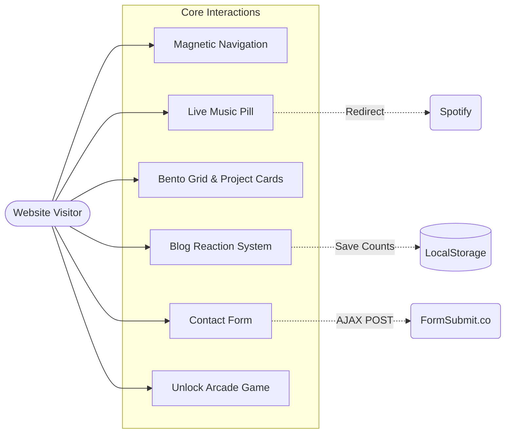

<div align="center">

# Harshit
### *AI & OS Developer Portfolio*

*Code is poetry, but performance is the rhythm.*

[View Live Portfolio](https://itsharshitgoat.github.io/Website/) · [Report Bug](https://github.com/itsharshitgoat/Website/issues) · [Request Feature](https://github.com/itsharshitgoat/Website/issues)

</div>

---

## 📖 Overview

Welcome to the comprehensive documentation for my personal portfolio. This isn't just a traditional static website; it is a **meticulously crafted digital experience** designed to showcase my technical journey, design philosophy, and engineering skills. 

Built with a **"Performance-First"** mindset, this site deliberately avoids the bloat of heavy JavaScript frameworks like React or Vue. Instead, it leverages **Vanilla JavaScript**, **Tailwind CSS**, and **HTML5 Canvas** to achieve hardware-accelerated animations, zero-build complexity, and a seamlessly fluid User Interface.

---

## ✨ Core Features & Highlights

- **Liquid Glass Music Pill:** A real-time tracker of my Last.fm listening history with live equalizer animations and seamless Spotify integration.
- **Harshit Arcade:** A hidden, fully functional HTML5 Canvas shoot-'em-up game triggered by an attention-based mechanic.
- **Magnetic Navigation Shell:** A smooth, frosted-glass blob that mathematically tracks and follows your hover state across the navigation bar.
- **Modern Interactions:** Scale-up card reveals, dark gradient overlays, and complex staggered entrance animations powered by `IntersectionObserver`.
- **Rich Social Previews:** Fully configured Open Graph and Twitter Cards for dynamic embedding across platforms like Discord, Twitter, and WhatsApp.

---

## 🏗️ System Architecture

This project is a testament to what can be achieved with modern browser primitives and intelligent asset delivery.

```mermaid
graph TD
    User((User)) -->|Visits Site| Browser[Web Browser]
    Browser --> Host[GitHub Pages / Edge CDN]
    
    subgraph Frontend Application
        HTML[HTML5 Structure]
        CSS[Tailwind CSS CDN]
        JS[Vanilla JavaScript ES6+]
        Canvas[HTML5 Canvas Game Engine]
        
        HTML --- CSS
        HTML --- JS
        JS --- Canvas
    end
    
    Host --> Frontend Application
    
    subgraph External Integrations & APIs
        LastFM[Last.fm API]
        FormSubmit[FormSubmit.co]
        LocalStorage[(Browser LocalStorage)]
        OG[Open Graph Metadata]
    end
    
    JS -->|Fetch currently playing track| LastFM
    JS -->|AJAX Serverless Contact POST| FormSubmit
    JS -->|Persist user reactions & states| LocalStorage
    HTML -.->|Provide rich link previews| OG
```

### Technical Stack Details
* **Vanilla JavaScript (ES6+):** Manages all internal state, DOM manipulation, staggered scroll animations, and third-party API integrations without a VDOM overhead.
* **Tailwind CSS (CDN):** Utilizes a utility-first CSS approach for rapid, responsive design. Custom configurations are applied dynamically to handle glassmorphism effects and complex Bento grid layouts.
* **HTML5 Canvas API:** Powers the internal particle system and collision detection for the hidden Arcade mini-game.
* **Serverless Backend:** FormSubmit.co is used to process contact form requests seamlessly via `fetch` API.

---

## 🌊 User Interaction & Data Flow



---

## 🔍 Deep Dive: Section-by-Section Details

### 1. Navigation & UI Shell
- **Magnetic Nav Blob:** A mathematical JS function calculates the exact `Left` and `Width` coordinates of the hovered link, sliding a frosted glass pill behind it.
- **Glassmorphism Header:** Uses `backdrop-blur-xl` and `bg-white/30` to maintain foreground readability while letting dynamic background colors bleed through.
- **Scroll Spy Mechanism:** An `IntersectionObserver` monitors every section and automatically triggers the corresponding navigation state in real-time.

### 2. The Hero Section
- **Typewriter Engine:** A custom-built JS loop that cycles through personal philosophies. It intelligently handles backspacing, variable typing speeds, and a custom CSS blinking cursor.
- **Staggered Entrance Waterfall:** Elements are injected into the DOM with varying CSS `transition-delay` properties to create a highly sophisticated, sequential loading sequence.

### 3. About & Journey
- **Horizontal Timeline Engine:** Implements `scroll-snap-type: x mandatory` for a precise "paged" scrolling feel. Custom navigation buttons calculate the exact `scrollLeft` offset to ensure accurate, fluid movement.
- **Hover Reveal Cards:** Features modern full-card background imagery. On hover, a smooth 700ms scale-up zoom triggers while a dark gradient overlay ensures text readability. The description text dynamically slides up and fades in.

### 4. Skills & Tools
- **3D Emoji Integration:** Programming languages and tech stacks are presented as pill-shaped tags with visually engaging, custom-sourced 3D emojis.
- **Squircle UI:** Soft-edged "Squircle" (rounded square) geometries lift dynamically in response to mouse movements.

### 5. Projects & Certifications
- **Bento Grid Layout:** An asymmetrical, highly modern layout system that adapts dynamically to different viewport sizes.
- **Modal Engine:** A custom-built modal system that intercepts clicks, locks body scrolling (`overflow: hidden`), applies a heavy background blur, and animates the target content outward from the center of the viewport.

### 6. Dynamic Music Pill (Last.fm Integration)
- **Live State Polling:** Uses the `user.getrecenttracks` method to fetch live data every 15 seconds.
- **Cache-Busting Logic:** Every fetch request is appended with a unique timestamp (`_=${Date.now()}`) to prevent aggressive browser caching.
- **Fluid UI Swaps:**
  - When playing: Displays song name, artist, and an actively moving CSS **Equalizer Animation**.
  - When offline: Gracefully transitions into a static "Last Listened" state.
  - Interactive: Clicking constructs a precise Spotify search URL (`artist:NAME track:NAME`).

### 7. Hidden Harshit Arcade
The **Social Pill** in the footer acts as a Trojan horse for a fully functional shoot-'em-up game.
- **Activation:** Requires an attention-based trigger (holding or hovering for 10 continuous seconds).
- **Physics & Engine:** Uses circle-to-point collision for lasers and circle-to-circle for ship-enemy contacts. Features independent particle lifecycles for engine thrusters/explosions and a tactile screen-shake upon game over.

---

## ⚡ Design & Performance Philosophy

1. **Zero Framework Overhead:** By entirely skipping React/Vue, the initial payload is significantly smaller, guaranteeing lightning-fast Time to Interactive (TTI).
2. **Hardware Acceleration:** Animations strictly utilize `transform` and `opacity` to ensure they are offloaded to the GPU, preventing expensive main-thread layout recalculations (layout thrashing).
3. **Typography:** Employs **Inter** for high-readability body copy, **Helvetica Neue** for high-impact headers, and **Roboto Mono** for technical data.
4. **Mobile First Architecture:** Seamlessly transitions into single-column responsive grids on mobile with touch-optimized scroll regions and tap targets.

---

## 🔮 Roadmap / Future Updates

I treat this portfolio as a living organism. Here is what is actively in the pipeline:

- [ ] **Dark Mode 2.0:** A completely revamped, deep-space dark theme with OLED-ready absolute blacks.
- [ ] **"Heaven & Hell" Update:** An ambitious, dual-realm thematic overhaul.
- [ ] **Interactive 3D Elements:** Integrating `Three.js` for an interactive, webGL-driven particle background in the Hero section.
- [ ] **Global Arcade Leaderboard:** Connecting the hidden Arcade game to a Firebase backend for high-score tracking.
- [ ] **Headless CMS Migration:** Decoupling the Blog/Research section into a headless CMS architecture (Sanity or Contentful) for frictionless content authoring.

---

## 💻 Local Setup & Deployment

Because this project embraces a zero-build philosophy, running it locally is incredibly straightforward:

1. **Clone the repository:**
   ```bash
   git clone https://github.com/itsharshitgoat/Website.git
   ```
2. **Navigate to the directory:**
   ```bash
   cd Website
   ```
3. **Run locally:**
   Simply double-click the `index.html` file to open it in any modern browser. Alternatively, serve it via a local development server for the best experience:
   ```bash
   npx serve .
   # or
   python -m http.server 8000
   ```
4. **Deployment:**
   Push the `main` branch to any static hosting provider (GitHub Pages, Vercel, Netlify).

---

## 📜 License & Credits

This project is open-sourced under the **[MIT License](LICENSE)**. 

If you draw inspiration from my code, design architecture, or structural approach, I kindly ask that you credit the original source.

<div align="center">
  <br/>
  <b>Crafted with ❤️ by Harshit</b>
</div>